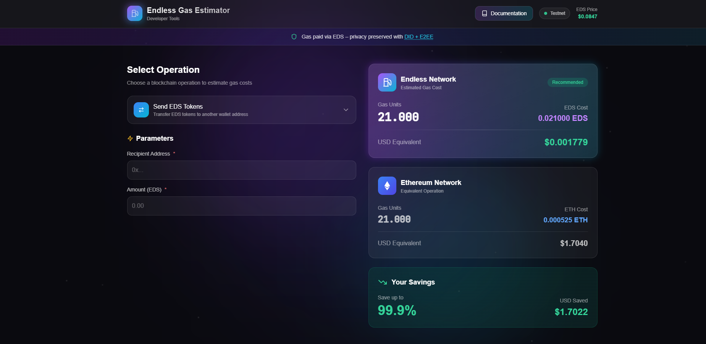

# Endless Gas Estimator

A simple, user-friendly tool to estimate gas costs for common actions on the Endless testnet/mainnet — helping developers plan transactions, reduce friction, and experiment more confidently.

**Live Demo:** https://endless-gas-estimator.vercel.app/



## What It Does
This lightweight web tool allows users to:
- Select common actions (e.g., Send EDS, Call Smart Contract Function, Mint Luffa Mini-App, AI Agent Call)
- Input amount or parameters
- Get instant gas estimate:
  - Gas units required
  - Cost in EDS
  - Approximate USD equivalent (mock price)
  - Comparison with Ethereum gas costs

All estimates are based on fixed testnet values (real integration with Endless SDK possible in future versions).

## Why It Matters to the Endless Ecosystem
- **Reduces onboarding friction**: New devs often fear "high gas" — this tool shows Endless is cheap and predictable.
- **Encourages experimentation**: Accurate estimates help devs test more mini-apps, agents, and tools without surprises.
- **Promotes adoption**: Lowers psychological barrier for Web2 devs transitioning to Endless.
- **High impact with low effort**: Simple tool that can evolve into an official SDK utility or Luffa mini-app feature.
- **Aligns with core values**: Supports Endless's mission of accessible, borderless, and efficient Web3.

## Features (MVP)
- Dropdown selection of common actions
- Input for amount/units
- Instant mock gas calculation + USD comparison
- Responsive dark-mode UI (Endless aesthetic)
- Pure HTML/CSS/JS — no frameworks, easy to extend/embed

## How to Run / Test
1. Clone the repo:
   ```bash
   git clone https://github.com/duchth1993/endless-gas-estimator.git
